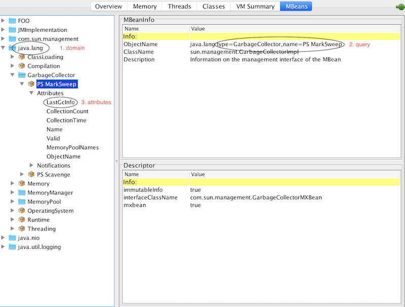

# Collecting JMX metrics from a JBoss service running in Standalone-mode

## Prerequisites

##  1. <a name='InstalltheInfrastructureagent'></a>Install the Infrastructure agent and JMX integration

- [Install Infrastructure for Linux using the package manager](https://docs.newrelic.com/docs/infrastructure/install-configure-manage-infrastructure/linux-installation/install-infrastructure-linux-using-package-manager)

  or 

- [Install Infrastructure for Windows Server using the MSI installer](https://docs.newrelic.com/docs/infrastructure/install-configure-manage-infrastructure/windows-installation/install-infrastructure-windows-server-using-msi-installer)

- [Install New Relic JMX integration](https://docs.newrelic.com/docs/integrations/host-integrations/host-integrations-list/jmx-monitoring-integration#install)

## 2. Expose JMX from JBoss

For this tutorial we will run a JBoss service Standalone-mode inside Docker with the help of the following Dockerfile:

```bash
FROM jboss/wildfly:18.0.0.Final

RUN /opt/jboss/wildfly/bin/add-user.sh admin1234 Password1! --silent

CMD ["/opt/jboss/wildfly/bin/standalone.sh", "-b", "0.0.0.0", "-bmanagement", "0.0.0.0"]
```

Build and run the image exposing the JMX port 9990:

```bash	
docker build -t test_jboss . && docker run -d -p 9990:9990 test_jboss
```
### Install JBooss Custom connector
JMX allows the use of custom connectors to communicate with the application. In order to use a custom connector, you have to place the files inside the sub-folder connectors where nrjmx is installed.

For this example I'll copy the connectors from the newly created docker container:

```bash
sudo docker cp <container_id>:/opt/jboss/wildfly/bin/client/ /usr/lib/nrjmx/connectors/
```

Test the JMX connection:

```bash
echo '*:*' | nrjmx  -port=9990 -H 0.0.0.0 --username=admin1234 --password=Password1! -r -s
```

##  3. Configure JMX integration


### 3.1 First step is creating a JMX integration configuration file `/etc/newrelic-infra/integrations.d/jmx-config.yml`

```yaml
integration_name: com.newrelic.jmx

instances:
  - name: jmx
    command: all_data
    arguments:
      jmx_host: 0.0.0.0
      jmx_port: 9990
      jmx_user: admin1234
      jmx_pass: Password1!
      jmx_remote: true
      jmx_remote_jboss_standlone: true
      collection_files : "/etc/newrelic-infra/integrations.d/jmx-custom-metrics.yml"
    labels:
      env: staging
```

All configuration options can be found in the public [documentation](https://docs.newrelic.com/docs/integrations/host-integrations/host-integrations-list/jmx-monitoring-integration#config).

### 3.2 Creating the metric collection configuration file.
In the JMX configuration file, we specified a collection file `jmx-custom-metrics.yml`. This file is used to define which metrics we want to collect.

We can inspect the available JMX metrics using nrjmx command directly or a visual tool like  JConsole.


nrjmx tool ouputs the jmx metrics in a JSON format. We can use jq tool to format the output to be more readable:

```bash
echo '*:*' | nrjmx  -port=9990 -H 0.0.0.0 --username=admin1234 --password=Password1! -r -s | jq
```

```bash
....
"jboss.threads:name=\"XNIO-1\",type=thread-pool,attr=LargestQueueSize": 0,
  "jboss.as.expr:subsystem=ejb3,thread-pool=default,attr=rejectedCount": "0",
  "jboss.as:core-service=management,access=authorization,constraint=sensitivity-classification,type=elytron,classification=elytron-security,attr=defaultRequiresRead": true,
  "jboss.as.expr:subsystem=infinispan,cache-container=ejb,thread-pool=expiration,attr=maxThreads": "1",
  "jboss.as:subsystem=ejb3,attr=disableDefaultEjbPermissions": true,
....
```

In order to monitor for example the “LargestQueueSize” the following nri-jmx collection file can be created:

```yaml
collect:
  - domain: jboss.threads
    event_type: AnyNameSample
    beans:
      - query: name="XNIO-1",type=thread-pool
        attributes:
          - LargestQueueSize
```

If for example we want to capture the “LargestQueueSize” attribute for multiple thread names, we can use the wildcard:

```yaml
collect:
  - domain: jboss.threads
    event_type: AnyNameSample
    beans:
      - query: name=*,type=thread-pool
        attributes:
          - LargestQueueSize
```

The following example illustrates how to create a collection file using information provided by the JConsole Java tool:



```yaml
collect:
  - domain: java.lang
    event_type: AnyNameSample
    beans:
      - query: type=GarbageCollector,name=PS MarkSweep
        attributes:
          - LastGcInfo
```

### 3.3 Checking data

Save the changes in the yaml files, and [restart](https://docs.newrelic.com/docs/infrastructure/install-infrastructure-agent/manage-your-agent/start-stop-restart-infrastructure-agent). After a few minutes, go to New Relic and run the following [NRQL query](https://docs.newrelic.com/docs/query-data/nrql-new-relic-query-language):

```sql 
FROM AnyNameSample SELECT *
```


